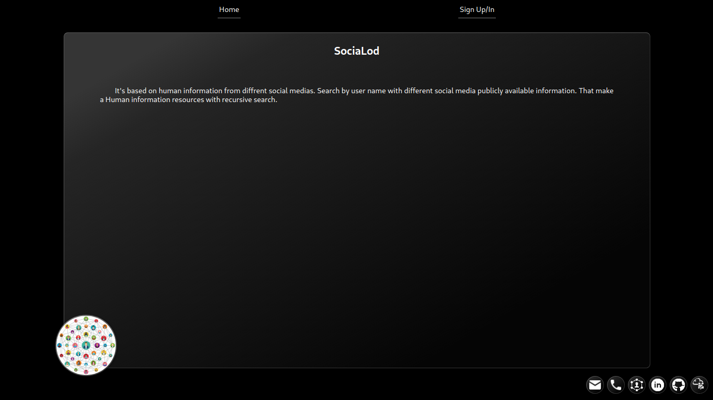
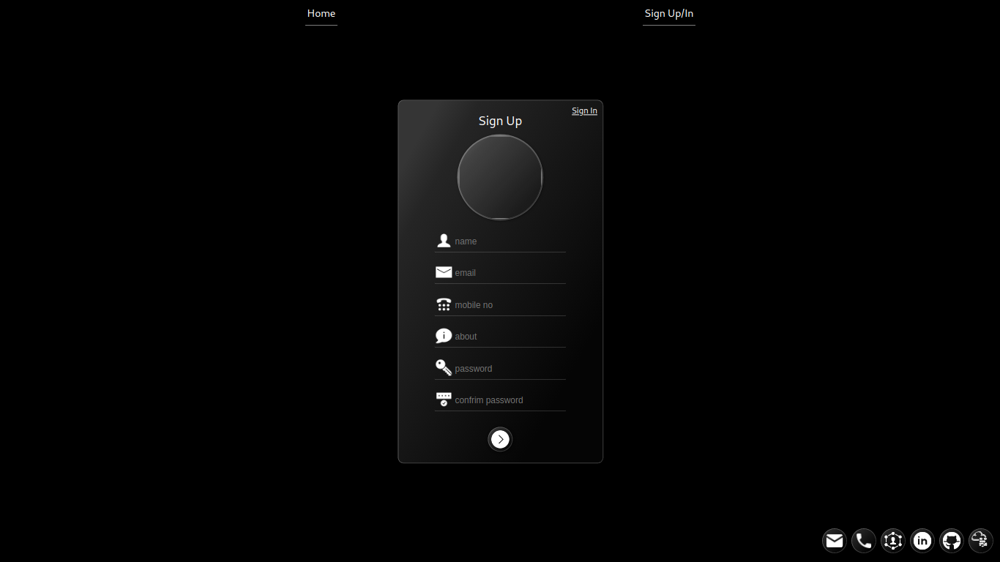

# SociaLod Frontend Web
Use this react template for SociaLod API. Scrap by social media profile links of user and Create information resource.

RUN
---
    # npm start

visit http://localhost:3000

SCREENSHOT
---
Home

Home with Login

SignIn

SignUp

Search By Link

Scraping Result

Search By Username

Account

Full info View
